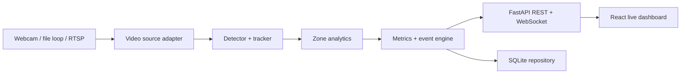

# Veratex Real-Time Video Intelligence — Codex Handoff Brief

## 1. What we are building

Veratex is preparing a computer-vision and analytics capability for a surveillance partner serving casino and hospitality environments. The immediate goal is not a production casino deployment. It is a compelling, runnable proof of concept that demonstrates the value of a future integration before Unity Surveillance supplies live camera feeds or a VMS/API connection.

The demonstration must process a continuous video stream, not a disconnected slideshow of pictures. Internally, inference may sample frames at a configurable rate, but the product experience should behave like a live video-analytics system.

The first vertical slice should prove:

1. continuous ingest from a webcam, local video loop, or authorized stream;
2. real-time person detection and anonymous multi-object tracking;
3. configurable table, seat, queue, or restricted-area zones;
4. occupancy, entries/exits, dwell time, and utilization metrics;
5. structured event creation and severity/priority handling;
6. REST and WebSocket access through a Veratex-owned API;
7. a live dashboard showing the annotated stream, KPIs, trends, and recent events.

The architecture must allow the demo source to be replaced later by an authorized Unity RTSP/ONVIF/VMS feed without rewriting the analytics or dashboard.

## 2. Business story for the demo

The initial flagship use case is table and seat occupancy analytics. It is easy to understand, supports operational ROI, and does not require the system to make accusations about people.

Useful demo metrics:

- current people count by table/zone;
- occupied versus available seats;
- player arrival and departure events;
- average and current dwell time;
- table utilization over time;
- dealer-zone presence or unattended-table duration;
- queue length and wait-time proxy;
- crowding or restricted-zone entry alerts;
- camera/source health and processing latency.

The broader product can later add dealer workflow analytics, unusual-behavior detection, searchable event transcripts, cross-camera correlation, analyst feedback, and integrations with table management or other casino systems. Those are not required for the first build.

## 3. Current integration reality

- Veratex does not currently receive Unity live feeds or production surveillance data.
- Do not block the POC on a Unity API.
- The likely production input is a copied camera stream exported through the incumbent VMS or directly through RTSP/ONVIF. The existing evidentiary VMS remains the system of record.
- Veratex should own an outward-facing analytics API so Unity or other authorized consumers can retrieve cameras, metrics, events, alerts, and summaries.
- A VMS-side API may still be needed for discovery, clip lookup, authentication, configuration, or event callbacks. That is a separate integration concern from the Veratex analytics API.
- Build a `VideoSource` adapter now. Later adapters may include `WebcamSource`, `FileLoopSource`, `RtspSource`, and `VmsSource`.

## 4. Demo footage strategy

Preferred source order:

1. **User-owned overhead webcam/phone setup:** Put cards/chips and marked seat zones around a table. This is the closest lawful simulation and gives full control over entries, exits, sitting, standing, and dealer presence.
2. **Rights-cleared casino stock footage:** Use for a visually convincing recorded demo when its license permits the intended use.
3. **Official live traffic or plaza camera:** Useful to prove real external live ingest, vehicle/person tracking, zone occupancy, stopped-object duration, congestion, and alerts. Access can be technically unstable and usage terms must be respected.
4. **Surveillance research data:** CEPDOF is useful for overhead tracking; VIRAT is useful for stationary-camera pipeline testing. Confirm the applicable license before redistribution or commercial use.

For a repeatable demo, loop an authorized MP4 through the application—or through a local RTSP restreamer such as MediaMTX—so the system behaves exactly like a continuous camera input.

Do not use news footage, police releases, third-party casino CCTV uploads, copied YouTube tours, or other public-but-not-clearly-reusable media in a client-facing demo.

## 5. POC architecture



Recommended local stack:

| Layer | Choice | Reason |
| --- | --- | --- |
| Video | OpenCV backed by FFmpeg | Simple webcam/file/RTSP capture with a path to production codecs |
| Detection | Ultralytics YOLO person model | Fast pretrained baseline; no custom training required for the POC |
| Tracking | ByteTrack | Stable anonymous track IDs and readily available integration |
| Analytics | Python zone geometry and event engine | Transparent, testable business logic |
| API | FastAPI + Pydantic | Strong fit with the source architecture, inference microservices, schemas, and WebSockets |
| Persistence | SQLAlchemy + SQLite | Zero-infrastructure local demo; repository abstraction can later target PostgreSQL/AWS stores |
| Dashboard | React + TypeScript + Vite | Aligns with the documented production direction |
| Charts | Recharts | Lightweight KPI and time-series presentation |

Important separation of concerns:

- `VideoSource` returns frames and source metadata.
- `Detector` returns typed detections.
- `Tracker` converts detections into anonymous tracks.
- `ZoneEngine` owns polygon membership, seat association, transitions, and dwell state.
- `EventEngine` turns state changes or thresholds into structured events.
- `Repository` persists metrics/events without coupling inference to a database.
- API and WebSocket layers read normalized models; they do not contain CV logic.

The pipeline must use bounded queues and drop stale frames when processing falls behind. For a real-time dashboard, low latency matters more than analyzing every frame.

## 6. Data contracts

Use UTC and ISO 8601. Generate UUIDs for durable records. Tracker IDs are session-scoped and must not be presented as real identities.

### Camera

```json
{
  "camera_id": "demo-table-01",
  "name": "Demo Table 1",
  "source_type": "file_loop",
  "status": "online",
  "fps_input": 30.0,
  "fps_inference": 5.0,
  "last_frame_at": "2026-07-21T23:00:00Z",
  "processing_latency_ms": 83
}
```

### Zone

```json
{
  "zone_id": "table-1",
  "camera_id": "demo-table-01",
  "name": "Table 1",
  "zone_type": "table",
  "polygon_normalized": [[0.15, 0.20], [0.85, 0.20], [0.90, 0.90], [0.10, 0.90]],
  "capacity": 6,
  "dwell_alert_seconds": 900
}
```

### Track observation

```json
{
  "camera_id": "demo-table-01",
  "track_id": 17,
  "timestamp": "2026-07-21T23:00:00.200Z",
  "class_name": "person",
  "confidence": 0.91,
  "bbox_xyxy": [412, 188, 533, 491],
  "zone_ids": ["table-1", "seat-3"]
}
```

### Event

```json
{
  "event_id": "c215e1bd-2f5c-48d7-9dbc-183876fd614d",
  "camera_id": "demo-table-01",
  "zone_id": "seat-3",
  "event_type": "zone_occupied",
  "severity": "info",
  "occurred_at": "2026-07-21T23:00:00.200Z",
  "track_id": 17,
  "attributes": {"occupancy": 1, "capacity": 1},
  "snapshot_ref": null
}
```

### Zone metric

```json
{
  "camera_id": "demo-table-01",
  "zone_id": "table-1",
  "timestamp": "2026-07-21T23:00:05Z",
  "occupancy": 4,
  "capacity": 6,
  "utilization_pct": 66.7,
  "entries_total": 12,
  "exits_total": 8,
  "average_dwell_seconds": 524
}
```

## 7. API boundary

Version every endpoint under `/api/v1`.

| Method | Path | Purpose |
| --- | --- | --- |
| GET | `/health` | Service, model, database, and source health |
| GET | `/api/v1/cameras` | List configured cameras and live status |
| GET | `/api/v1/cameras/{camera_id}` | Camera details and processing status |
| POST | `/api/v1/cameras/{camera_id}/start` | Start an explicitly configured source |
| POST | `/api/v1/cameras/{camera_id}/stop` | Stop processing that source |
| GET | `/api/v1/cameras/{camera_id}/snapshot` | Latest annotated JPEG for the local dashboard |
| GET | `/api/v1/zones` | List zone configuration |
| GET | `/api/v1/metrics/current` | Current occupancy and utilization by camera/zone |
| GET | `/api/v1/metrics/summary` | Time-bucketed historical summaries |
| GET | `/api/v1/events` | Filterable recent event history |
| POST | `/api/v1/events/{event_id}/feedback` | Analyst acknowledge/dismiss feedback |
| WS | `/ws/live` | Push camera status, metrics, tracks, and events |

For the local POC, the dashboard may use a multipart JPEG stream or regularly refreshed annotated snapshot while metrics/events arrive over WebSocket. Do not base64-encode full frames into every WebSocket event.

Future external access should add OAuth2/JWT or API-key authentication, tenant scoping, rate limits, audit logs, OpenAPI examples, and idempotency where appropriate. Local demo authentication may be disabled behind an explicit development setting.

## 8. Dashboard requirements

The main screen should have:

- a live annotated video panel;
- current occupancy, occupied seats, utilization, average dwell, and latency KPI cards;
- table/seat zone overlay and anonymous track labels;
- a recent-event feed that updates live;
- a utilization/occupancy trend chart;
- camera selector and source-health indicator;
- a demo-control panel to select webcam or authorized video, start/stop processing, toggle overlays, and reset session metrics.

Make the dashboard client-presentable but operational rather than flashy. A user should understand the business value within 30 seconds.

## 9. Event logic for the first build

Implement deterministic, configurable rules before attempting learned anomaly detection:

- `zone_entered` and `zone_exited` after a short debounce period;
- `zone_occupied` and `zone_vacant` on state transitions;
- `capacity_reached` when occupancy meets capacity;
- `dwell_threshold_exceeded` once per track/zone threshold crossing;
- `dealer_zone_unattended` when configured and the zone remains empty beyond a threshold;
- `source_offline` when frames stop beyond a health threshold;
- optional `restricted_zone_entry` for the demo.

Persist analyst feedback using `acknowledged` or `dismissed` plus an optional reason. This creates the foundation for future model tuning.

## 10. Testing and acceptance criteria

The first vertical slice is accepted when:

- setup works from a clean checkout using documented commands;
- webcam and file-loop modes work, or the unavailable mode fails with an actionable message;
- detections and stable track IDs render on the video;
- normalized polygon zones scale correctly with video resolution;
- occupancy changes after debouncing rather than flickering frame by frame;
- dwell time uses monotonic elapsed time in-process and persists completed visits correctly;
- recent events and current metrics are available through REST;
- the dashboard receives changes without page refresh;
- source disconnects do not crash the entire application;
- tests cover zone membership, debounce, dwell thresholds, event deduplication, and API schema validation;
- README includes setup, commands, troubleshooting, demo script, limitations, and how to replace the source with RTSP later;
- no credentials, licensed footage, generated runtime data, model weights, or recorded faces are committed.

Suggested performance targets for a laptop demo:

- configurable 2–5 inference frames per second;
- dashboard metric/event update within 1 second of processed state;
- annotated display remains visually continuous even when inference is sampled;
- bounded memory use during a 30-minute loop;
- recover or clearly mark offline after a temporary source failure.

## 11. Delivery sequence

### Pre-MVP sales/technical POC

This is the immediate Codex build and is separate from the formal enterprise roadmap.

1. Scaffold backend, frontend, shared config, and tests.
2. Implement file-loop and webcam sources plus source health.
3. Add pretrained person detection and ByteTrack.
4. Add polygon zones, occupancy, entries/exits, and dwell state.
5. Add SQLite event/metric persistence, REST endpoints, and WebSocket messages.
6. Build the live dashboard and annotated stream.
7. Add deterministic alerts, analyst feedback, demo configuration, tests, and documentation.
8. Run a scripted 10-minute demo and fix reliability issues.

### Formal roadmap from the supplied planning documents

| Phase | Timing | Outcome |
| --- | --- | --- |
| Discovery and setup | Month 1 | Pilot charter, camera/VMS compatibility audit, cloud environment, compliance approval, starter labeled footage |
| MVP build | Months 2–3 | Pilot ingest, Model 1 detection, baseline Model 2, event-triggered Model 3, basic dashboard and controls |
| MVP pilot and validation | Month 4 | Live analyst use, feedback, first fine-tune, measured latency/accuracy/cost, go/no-go |
| Department scale-out | Months 5–6 | 500–1,500 cameras in waves, hardened dashboard, full RBAC, support runbook and training |
| Enterprise rollout | Months 7–8 | Remaining agreed zones/property, regulatory readiness, executive reporting, steady-state ownership |

## 12. Long-term reference architecture

The project documents rate the overall architecture highly feasible, with the largest risks being GPU/inference cost, operator-specific anomaly-model tuning, VMS export capability, data residency, and alert fatigue.

The recommended production pattern is:

- Axis/Hanwha IP cameras or incumbent Genetec VMS tap using RTSP/ONVIF;
- NVIDIA Jetson Orin edge nodes used for relay/buffering and, where bandwidth requires, basic filtering/inference;
- dedicated camera VLAN and redundant network;
- GStreamer/FFmpeg ingestion containers on ECS;
- Kinesis carrying metadata and S3 object references—not raw frames;
- Glue Schema Registry for a versioned camera/timestamp/zone/frame-reference schema;
- encrypted S3 storage with bounded lifecycle rules;
- continuously running object/context detection (document names YOLOv8 on SageMaker);
- operator-specific PyTorch anomaly model trained on labeled casino footage;
- event-triggered vision-language transcript generation through Claude on Bedrock, never continuous across every frame;
- Step Functions/EventBridge orchestration with a code-enforced human review gate;
- Timestream for time-series metrics, OpenSearch for transcripts/search, and Lambda/EventBridge for correlation and severity;
- React/Amplify dashboard, API Gateway WebSockets, Cognito RBAC, KMS/IAM/PrivateLink, and CloudTrail audit logging.

The POC should preserve replaceable interfaces and clean data contracts consistent with that direction without prematurely implementing it.

## 13. Compliance, privacy, and product boundaries

- The AI pipeline is additive to the existing compliant recording system; it does not replace evidentiary video or required camera coverage.
- Human review is mandatory. No model output may directly trigger enforcement, exclusion, discipline, or an accusation.
- Biometric identification, face recognition, self-exclusion matching, and demographic inference are out of scope.
- Confirm jurisdiction-specific data residency, retention, access-control, surveillance, and gaming requirements before a live casino pilot.
- Minimize video retention. Keep event metadata separate from raw media and link back to the VMS clip where authorized.
- Apply least privilege, encryption in transit/at rest, tenant isolation, auditability, and bounded retention in production.
- Treat raw footage and event media as sensitive. Never expose production camera streams to a public endpoint.

## 14. Risks Codex should actively prevent in the POC

| Risk | POC mitigation |
| --- | --- |
| Scope explosion into the enterprise architecture | Finish the local vertical slice before cloud integrations |
| Unstable public camera access | Make webcam/file loop the deterministic default |
| Low FPS or runaway CPU/GPU | Configurable sampling, bounded queues, stale-frame dropping, instrumentation |
| Flickering occupancy | State machine with debounce/hysteresis |
| Tracker ID churn | Tune tracking thresholds and calculate visits at the zone level |
| False claims about anomalous behavior | Use deterministic neutral events and label learned anomaly detection as future work |
| Privacy leakage | Anonymous IDs, no face recognition, optional/disabled snapshots, no recording by default |
| Vendor lock-in | Interfaces around video, inference, persistence, and event delivery |
| Demo fragility | Include a known-good local sample configuration and a rehearsed demo script |

## 15. Decisions that can be deferred

Do not stop the first build for these decisions:

- exact Unity VMS/API protocol;
- final AWS account/region and infrastructure-as-code tool;
- production authentication provider;
- which casino department becomes the formal pilot;
- final camera count and retention window;
- custom anomaly model architecture;
- VLM vendor/model selection;
- production multi-tenancy and billing.

Record these as explicit assumptions or open questions instead.

## 16. Source-document synthesis

This brief incorporates the supplied July 2026 project materials:

- `01 Technology Feasibility Assessment.docx`: high overall feasibility; critical dependencies are camera audit, labeled operator footage, cost control, data residency, and analyst adoption.
- `02 High Level Solution Architecture.docx`: AWS-managed reference architecture from RTSP/VMS capture through Kinesis/S3, model orchestration, analytics stores, and React/WebSocket reporting.
- `Technical_Architecture_Reference(1).docx`: edge-to-dashboard component breakdown; FastAPI/gRPC/WebSocket integration options; parallel detection/anomaly stages; event-triggered transcript generation.
- `03 Implementation Roadmap Timeline.docx`: five phases over 6–8 months with a working formal MVP by the end of Month 4.
- `Techno Functional Implementation Reference.xlsx`: stage-by-stage tooling, deliverables, constraints, owners, target timing, completion gates, and cross-stage tracker.

Where this brief recommends a smaller local stack, it is intentionally defining a pre-MVP demonstrator—not overriding the approved production direction.
